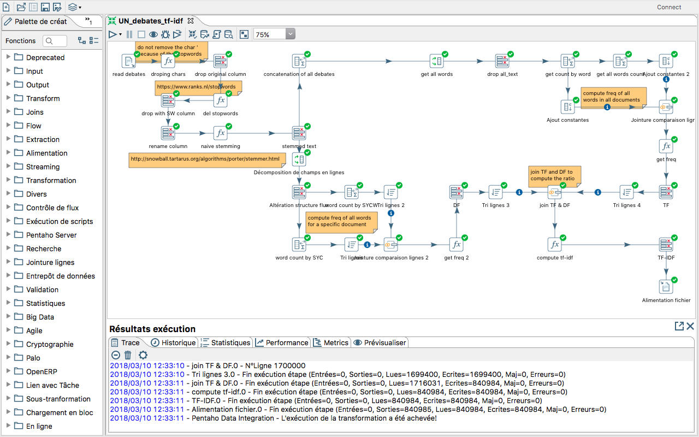
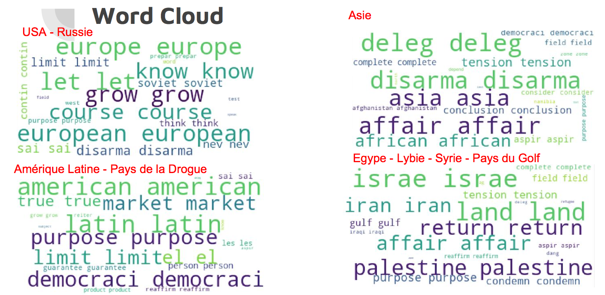
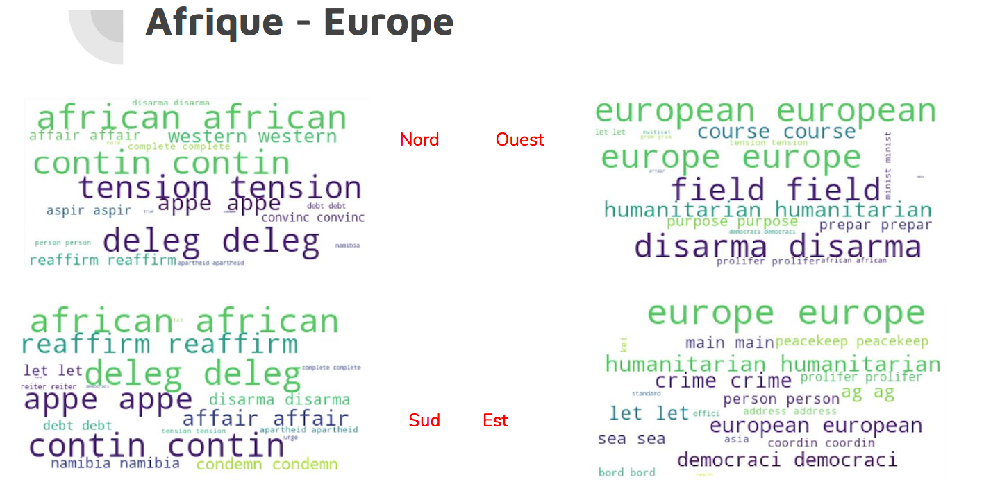

# BI Project

Trying to Analyse the countries preoccupation given their speeches given at the UN.

 - main.ktr : script to create the tf-idf base of speech by country by year by session
 - transform_sql2scv.ktr : script used to transform the world.sql file into a csv one
 - join_bases : join the world.csv, UN_debates_tf-idf.csv bases

## Screenshot

This is the tf-idf calculation script : 

## Word Clouds Found

